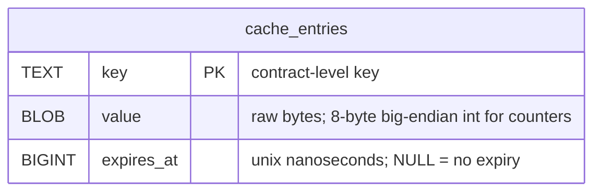
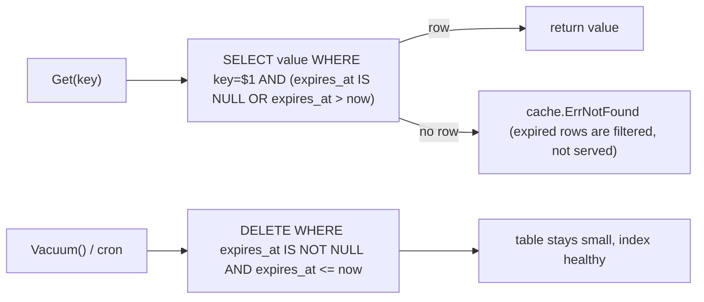

# ubgo/cache-pg — Postgres-backed cache for Go

Postgres-backed (and SQLite-compatible) cache adapter for Go, implementing the [`github.com/ubgo/cache`](https://github.com/ubgo/cache) contract over the standard library `database/sql`. A durable, single-table, codegen-free cache for teams that already run Postgres and would rather not add Redis just for caching.

If you searched for "Postgres cache library Go", "SQL-backed cache Golang", "database cache adapter Go", or "durable cache without Redis" — this is the SQL backend of the `ubgo/cache` family. It passes the shared `cachetest.Run` conformance suite.

## Why this adapter

- **No new infrastructure.** If you run Postgres, you already have the cache store. One table, two indexes, `Migrate()` creates them.
- **Durable.** Cached entries survive process restarts (unlike an in-memory cache) — useful for expensive-to-recompute values and idempotency keys.
- **Driver-agnostic.** Takes a `*sql.DB`. Bring `pgx`, `lib/pq`, or — for tests and embedded use — SQLite. The conformance suite runs in-process on SQLite with **no Docker**.
- **Codegen-free.** Plain `database/sql`, no ORM, no generated client. Easy to audit, easy to vendor.
- **Atomic where it matters.** `SetNX`, `Incr`, `Decr`, and `SetMulti` run inside transactions so concurrent callers stay correct.

## `database/sql` vs Ent — the deliberate deviation

The original plan (PLAN §4.9) specified an **Ent** schema with a generated client. This adapter instead uses portable `database/sql`: one table, no code generation, identical SQL on Postgres and SQLite.

Rationale: the `cache.Cache` contract needs none of Ent's client surface (no graph traversal, no typed entities — just key/value/expiry). A codegen-free adapter is simpler to ship, audit, and — critically — test Docker-free on SQLite. The trade-off is no Ent-native client; if an Ent integration is ever required this decision is recorded here and in `doc.go` so the divergence is explicit, not accidental.

## Schema



`Migrate` also creates `cache_entries_expires_at` on `expires_at` so `Vacuum` and expiry filters stay index-backed.

## Install

```sh
go get github.com/ubgo/cache-pg
```

Requires Go 1.24+. Bring your own driver, e.g. `github.com/jackc/pgx/v5/stdlib` (Postgres) or `modernc.org/sqlite` (SQLite, no cgo).

## Quick start

```go
package main

import (
	"context"
	"database/sql"
	"log"
	"time"

	_ "github.com/jackc/pgx/v5/stdlib"
	pgcache "github.com/ubgo/cache-pg"
)

func main() {
	db, err := sql.Open("pgx", "postgres://localhost:5432/app?sslmode=disable")
	if err != nil {
		log.Fatal(err)
	}

	c := pgcache.New(db)            // Postgres dialect by default
	if err := c.Migrate(context.Background()); err != nil { // idempotent
		log.Fatal(err)
	}
	defer c.Close()

	ctx := context.Background()
	_ = c.Set(ctx, "report:q3", []byte("…"), time.Hour)

	// Reclaim physically-dead rows on a ticker / cron:
	_ = c.Vacuum(ctx)
}
```

## Constructor and options

### `New(db *sql.DB, opts ...Option) *Cache`

Wraps an open `*sql.DB`. The adapter never closes the DB you own — `Close()` only marks the adapter closed. Call `Migrate` once before first use.

### `WithDialect(d Dialect) Option`

Selects placeholder + DDL syntax. `pgcache.Postgres` (default) emits `$1`-style placeholders. `pgcache.SQLite` rebinds them to `?` — used by the in-process test suite and any embedded SQLite deployment.

```go
c := pgcache.New(db, pgcache.WithDialect(pgcache.SQLite))
```

### `WithTable(name string) Option`

Overrides the table name (default `cache_entries`). Use to run multiple isolated caches in one database.

```go
c := pgcache.New(db, pgcache.WithTable("session_cache"))
```

### `WithClock(fn func() time.Time) Option`

Overrides the time source. Intended for deterministic tests (drive TTL/Vacuum without `time.Sleep`).

```go
fixed := time.Now()
c := pgcache.New(db, pgcache.WithClock(func() time.Time { return fixed }))
```

## Migrate and Vacuum

### `Migrate(ctx) error`

Creates the table and `expires_at` index with `IF NOT EXISTS`. Idempotent — safe to call on every boot. Returns `cache.ErrClosed` after `Close()`.

### `Vacuum(ctx) error`

Reads filter expired rows out (`expires_at <= now`), so a stale row is never *served* — but the row physically remains until `Vacuum` deletes it. Run `Vacuum` periodically (cron / ticker) to reclaim space and keep the table small:

```go
go func() {
	t := time.NewTicker(10 * time.Minute)
	for range t.C {
		_ = c.Vacuum(context.Background())
	}
}()
```



## Method reference

```go
ctx := context.Background()

// Reads (all filter expired rows: expires_at IS NULL OR expires_at > now)
b, err := c.Get(ctx, "k")                        // ErrNotFound on miss/expiry
m, err := c.GetMulti(ctx, []string{"a", "b"})    // per-key Get; missing keys absent
ok, err := c.Has(ctx, "k")
d, err := c.TTL(ctx, "k")                        // 0 = no expiry, ErrNotFound = none

// Writes
err = c.Set(ctx, "k", []byte("v"), time.Minute)  // INSERT ... ON CONFLICT DO UPDATE
err = c.SetMulti(ctx, map[string]cache.Item{     // single transaction
	"a": {Value: []byte("1"), TTL: time.Minute},
})
created, err := c.SetNX(ctx, "lock", []byte("1"), time.Minute) // txn: del-expired + insert-if-absent

// Expiry
err = c.Expire(ctx, "k", time.Hour)              // UPDATE expires_at; ErrNotFound if absent/expired
err = c.Touch(ctx, "k")                          // Expire(key, 1h)

// Counters (transactional read-modify-write; value is 8-byte big-endian int)
n, err := c.Incr(ctx, "hits", 1)                 // missing key starts at 0
n, err = c.Decr(ctx, "hits", 2)

// Delete
err = c.Del(ctx, "a", "b")
err = c.DeleteByPrefix(ctx, "user:")             // LIKE 'user:%' ESCAPE '\' (wildcards neutralised)
err = c.Flush(ctx)                                // DELETE FROM table

// Maintenance / iterate / lifecycle
err = c.Vacuum(ctx)                               // physically remove expired rows
it := c.Iterate(ctx, cache.IterateOpts{Prefix: "user:"})
defer it.Close()
for it.Next() { _ = it.Key(); _ = it.Value() }
_ = it.Err()
err = c.Ping(ctx)
s := c.Stats()                                    // Entries = live COUNT(*) (best-effort)
err = c.Close()                                   // idempotent; does NOT close your *sql.DB
```

### Behaviour notes that bite if ignored

- `expires_at` is **unix nanoseconds**, `NULL` = no expiry. All reads carry an `expires_at IS NULL OR expires_at > now` predicate so an expired row is never served even before `Vacuum`.
- `DeleteByPrefix` / `Iterate` build `LIKE` patterns and neutralise `%`, `_`, `\` in the literal prefix, with `ESCAPE '\'`. A prefix containing a `%` will not accidentally match everything.
- `SetNX` / `Incr` / `Decr` / `SetMulti` run in transactions. `SetNX` deletes an expired row first, then does an `INSERT ... ON CONFLICT DO NOTHING` and reports whether a row was created.
- Counters are stored as an 8-byte big-endian integer in the `value` column; do not mix counter and blob semantics on the same key.
- `WithDialect(SQLite)` rebinds `$N` placeholders to `?`. Queries are authored once in Postgres syntax and rewritten by `rebind`.

## FAQ

### Can I use Postgres as a cache in Go?

Yes. `pgcache.New(db)` + `Migrate(ctx)` gives you a `cache.Cache` backed by one table. Good for durable, moderate-throughput caching when you already run Postgres and don't want a separate Redis.

### Does it work with SQLite?

Yes — `pgcache.New(db, pgcache.WithDialect(pgcache.SQLite))`. Same SQL, placeholders rebound to `?`. This is exactly how the Docker-free conformance suite runs.

### Why `database/sql` instead of Ent (the plan said Ent)?

Deliberate. The cache contract needs no ORM surface; plain SQL is simpler to ship, audit, and test Docker-free, and runs identically on Postgres and SQLite. Recorded in `doc.go` and above so the divergence is explicit.

### Do expired entries disappear automatically?

They stop being *served* immediately (every read filters on `expires_at`). The row is physically removed only by `Vacuum` — run it on a cron/ticker to reclaim space.

### Which driver should I use?

Any `database/sql` driver: `github.com/jackc/pgx/v5/stdlib` or `github.com/lib/pq` for Postgres; `modernc.org/sqlite` (pure Go) or `mattn/go-sqlite3` for SQLite.

### Is `DeleteByPrefix` injection-safe with `%`/`_` in the prefix?

Yes. The literal prefix is escaped (`\`, `%`, `_`) and the query uses `LIKE … ESCAPE '\'`, so wildcard characters in your prefix match literally.

### Does `Close()` close my database pool?

No. It only marks the adapter closed (idempotent). The `*sql.DB` is yours.

### How is it tested without Docker?

The conformance suite opens an in-memory SQLite database (`file::memory:?cache=shared`) per test and runs `cachetest.Run`. A real-Postgres smoke test belongs behind an optional `task smoke`; the gate needs zero external services.

## Positioning vs other `ubgo/cache` adapters

| Adapter | Backing store | Durable | TTL introspection | Prefix delete | Best for |
|---|---|---|---|---|---|
| **cache-pg** (this) | Postgres / SQLite | Yes | Yes | Yes (`LIKE`) | Durable cache where you already run Postgres |
| [cache-redis](https://github.com/ubgo/cache-redis) | Redis 6+ | configurable | Yes | Yes (`SCAN`) | Shared distributed cache, low latency |
| [cache-tiered](https://github.com/ubgo/cache-tiered) | composes others | via tiers | via tiers | via tiers | L1/L2 hot-path latency |
| [cache-memcached](https://github.com/ubgo/cache-memcached) | Memcached | No | No (unsupported) | No (unsupported) | Drop-in Memcached interop |

## Contributing

See [CONTRIBUTING.md](./CONTRIBUTING.md) for the build/test/lint gate, the conformance contract, and the in-memory SQLite test setup.
